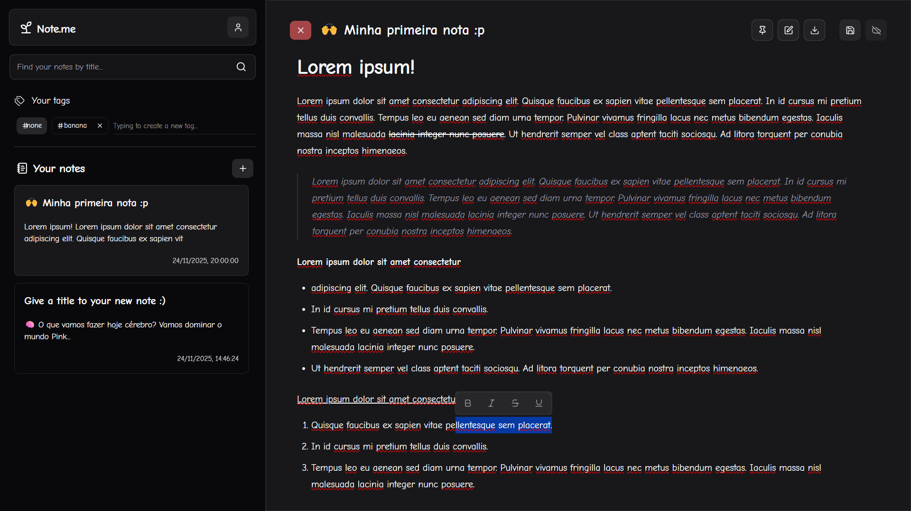

# **🌱 Note.me**

Boas vindas ao projeto **Note.me**! Um MVP (Minimum Viable Product) para uma aplicação de gerenciamento de notas simples e intuitiva. Esta aplicação possui armazenamento local, no navegador, através do [Dexie](https://dexie.org/), e armazenamento remoto, através do [Turso](https://turso.tech/).



## **🚀 Como executar o projeto**

1. Clone o repositório:

```bash
git clone https://github.com/BrazucaDeveloper/note-me.git
```

2. Instale as dependências:

```bash
pnpm install
```

3. Copie o arquivo `.env.example` para `.env` e cole suas chaves (Clerk e Turso) de API:

```bash
cp .env.example .env
```

4. Execute o projeto:

```bash
pnpm build && pnpm preview
```

5. Abra seu navegador e vá para `http://localhost:5173`

## **⚒️ Tecnologias utilizadas**

- ⚡ [Vite](https://vitejs.dev/) - Ferramenta de construção WEB
- ⚛️ [React](https://reactjs.org/) - Biblioteca Front-End
- 🟦 [TypeScript](https://www.typescriptlang.org/) - Superset de JavaScript
- 🎨 [Tailwind CSS](https://tailwindcss.com/) - Framework CSS focado em utilitários
- 🧩 [Shadcn UI](https://shadcn.com/) - Componentes Tailwind CSS
- 👤 [Clerk](https://clerk.com/) - Gerenciador de usuários
- ☁️ [Turso](https://turso.tech/) - Banco de dados, SQLite, em nuvem
- 📝 [Tiptap](https://tiptap.dev/) - Editor de texto React
- 🧹 [Biome](https://biomejs.dev/) - Formatador de código
- 💾 [Dexie](https://dexie.org/) - Biblioteca para acessar o IndexDB

## **🥸 Creator**

- 🧑‍💻 [BrazucaDeveloper](https://github.com/BrazucaDeveloper) | Full Stack Developer

## **📝 License**

Este projeto está licenciado sob a licença MIT - veja o arquivo [LICENSE](LICENSE) para obter detalhes.
